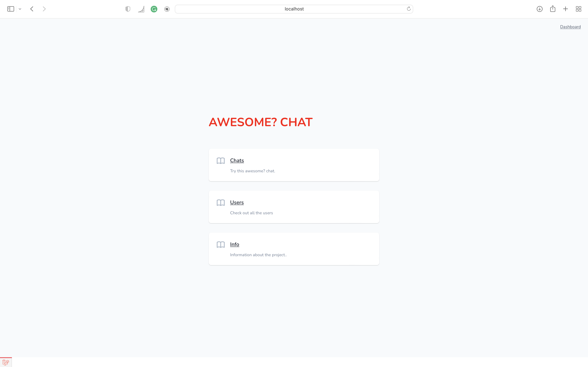
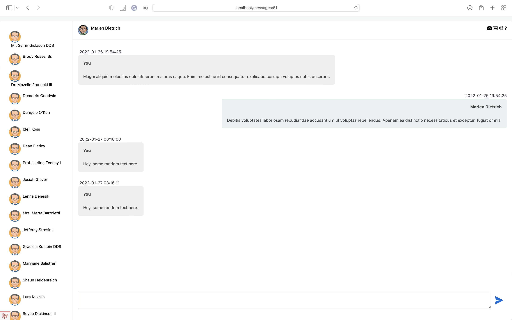

# Message App
A web chat app.

## Description
The repository contains the project for the [Modern Web Application II](https://harbour.space/computer-science/courses/modern-web-application-2-431) course at [Harbour.Space University](https://harbour.space) in January 2022.

### Dependencies
This is a standard Laravel project. All dependencies are listed in <code>composer.json</code>.

### Installing
The standard way of installing a Laravel application suffices

Clone the repository
```
git clone https://github.com/aniervs/Modern-Web-Dev2
```

Go into the app directory & install composer dependencies

```
composer install
```

Copy <code>.env.example</code> to <code>.env</code> and make sure to set the application name, application url and database parameters.

Set the application key

```
php artisan key:generate
```

Migrate so the tables are created

```
php artisan migrate
```

If wanted, you can seed the app with some test data

```
php artisan db:seed
```

Install npm dependencies and compile assets

```
npm install && npm run dev
```

## Authors

Anier Velasco Sotomayor
- github: [aniervs](https://github.com/aniervs)

## Acknowledgments
Thank you to [Harbour.Space University](https://harbour.space) for organising the Modern Web Application II course.

## Sample pictures 






